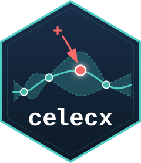

# celecx 

**C**omputer **E**xperiment **LE**arning **C**urve e**X**trapolation

Tools for active learning on computer experiments, with support for learning curve extrapolation and progress forecasting.

## Installation

```r
# Install dependencies from GitHub
remotes::install_github("mlr-org/paradox")
remotes::install_github("mlr-org/bbotk@celecx")
remotes::install_github("mlr-org/mlr3mbo@celecx")

# Install celecx
remotes::install_github("mlr-org/celecx")
```

## Example

Run active learning to explore an unknown function:

```r
library("celecx")
library("mlr3")

# Define objective (unknown function to learn)
objective <- ObjectiveRFun$new(
 fun = function(xs) list(y = sin(xs$x * pi) + 0.1 * rnorm(1)),
 domain = ps(x = p_dbl(lower = 0, upper = 2)),
 codomain = ps(y = p_dbl(tags = "learn"))
)

# Run active learning
result <- optimize_active(
 objective = objective,
 term_evals = 20L,
 learner = lrn("regr.km", covtype = "matern5_2"),
 se_method = "auto",
 batch_size = 1L,
 multipoint_method = "greedy"
)

# Access results
result$instance$archive$data  # All evaluated points
```

## License

MIT
